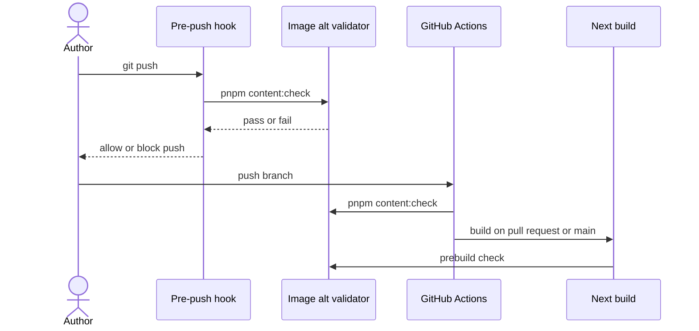

# Accessibility contract

Site maintainers should describe each content image before pushing or publishing
it. Run `pnpm content:check` after editing MDX or image markup. The site aims at
WCAG 2.2 AA while keeping the color and motion described in
[Design principles](./design-principles.md).

## Image descriptions

Writing photos, featured images, initiative covers, trailer posters, galleries,
project thumbnails, Markdown images, MDX image components, and authored JSX
images need nonblank alt text. The check includes drafts. Use words that explain
the image in its page context, such as “A bus turning onto Maryland Parkway at
dusk.” An image that adds no information can use literal `alt=""` with
`aria-hidden="true"` in JSX or MDX. Markdown’s empty `` does not mark
decoration clearly enough and fails the check.

The validator rejects a missing alt attribute and a dynamic JSX expression
that can resolve to an empty string. Dynamic descriptions still need browser
review because source analysis cannot prove what every runtime value says.
Micropub photo posts require JSON photo objects with `value` and nonblank
`alt`. Upload files to `/micropub/media` first. A post with a bare URL, form
photo field, or multipart photo file receives `400 invalid_request` before any
content write or GitHub commit.

The sequence diagram shows when a hand-authored image receives its checks.

The local hook can be skipped, so CI checks every branch push and the build
checks again. Micropub calls the same description policy before writing a post.

## Interaction rules

Use links for destinations and buttons for local actions. Every in-site link
uses `SiteLink` under [the link contract](./links.md). The contents list uses
fragment links. Dialogs return focus to their opener. Popovers focus their
first action and return focus when dismissed. Collapsed footer controls stay
out of the tab order. The homepage Focuses buttons report pressed only when a
visitor pins a focus. The studio pager has 24px hit targets while its dots keep
their original size. Forced colors get visible outlines and boundaries, and
reduced motion removes decorative transitions.

## Evidence and limits

On 28 September 2026, the production build passed the image check. Unit tests
covered missing and whitespace alt text, drafts, decorative images, galleries,
JSX, and Micropub rejection. Chromium axe checks covered the homepage, writings,
initiatives, search, brand, 404 and 500 pages, the IndieAuth fallback, the open
command palette, and the open homepage detail view. Keyboard checks covered
dialog focus return, the feed popover, the footer, Focuses, and the pager at
desktop and phone widths. A 320px reflow check and forced-color and reduced-motion
checks passed. Safari’s accessibility tree exposed the homepage controls and
dialog labels, and Escape returned focus to the opening link.

No public writing or initiative detail page was available because the current
content is draft. The authenticated IndieAuth consent screen and a successful
Micropub publish need a configured acceptance environment. VoiceOver’s spoken
announcements were not captured by the available browser tooling, so a person
must check those before claiming a complete manual screen-reader review. These
limits do not weaken the build-time image gate.
