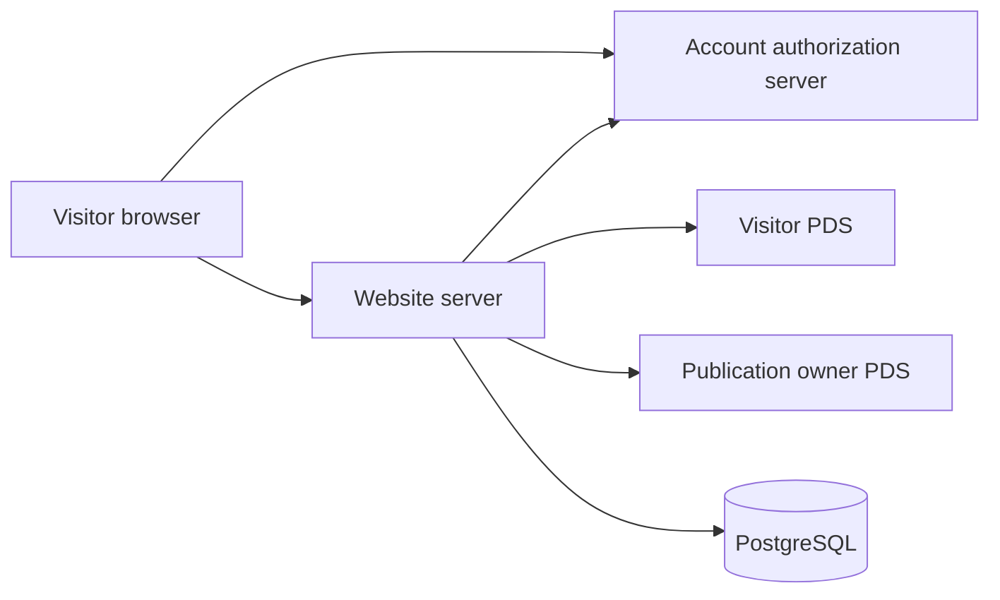
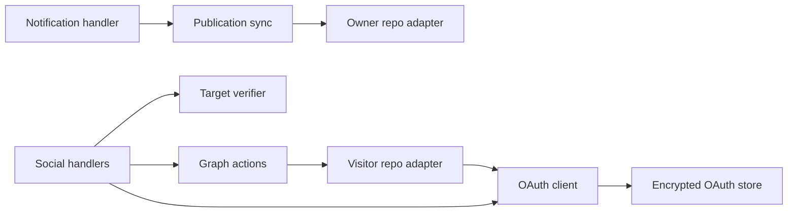

# AT Protocol

This document is for the maintainer of willie.page. Use it to configure publishing and visitor sign-in, then check a deployment before calling it ready.

The site publishes Standard.site publication and document records to the owner's resolved PDS. Visitors can subscribe to the publication and recommend a published writing through their own account provider. The site requests `atproto include:site.standard.authSocial`, which grants access to subscription and recommendation records. [Standard.site permissions](https://standard.site/docs/permissions/) define that scope.

## Configuration

Production uses the existing owner DID `did:plc:iyn6nc3ffqm2e3555exyrgvv` and publication key `3mwxne5td6lid`. Keep both stable. The publication URI and document-key algorithm remain unchanged.

| Variable                     | Purpose                                                                                                      |
| ---------------------------- | ------------------------------------------------------------------------------------------------------------ |
| `NEXT_PUBLIC_SITE_ORIGIN`    | Public origin; production defaults to `https://willie.page`. Isolated deployments must set their own origin. |
| `NEXT_PUBLIC_ATPROTO_DID`    | Publication owner and public DID discovery.                                                                  |
| `NEXT_PUBLIC_BLUESKY_HANDLE` | Display handle; profile links use the DID.                                                                   |
| `ATPROTO_PUBLICATION_RKEY`   | Publication TID generated once.                                                                              |
| `ATPROTO_APP_PASSWORD`       | Owner app password for publishing; sensitive and production-only.                                            |
| `ATPROTO_OAUTH_JWK`          | Private ES256 signing JWK with a unique `kid`; sensitive server variable.                                    |
| `ATPROTO_OAUTH_STORAGE_KEY`  | Base64 encoding of 32 random bytes for credential encryption; sensitive server variable.                     |
| `POSTGRES_URL`               | Durable OAuth and browser sessions; migration `005_atproto_oauth.sql` is required.                           |
| `INDIEWEB_NOTIFY_SECRET`     | Sensitive bearer secret shared with GitHub `INDIEWEB_NOTIFY_SECRET_PRODUCTION`.                              |

OAuth signing and storage keys differ between production and acceptance. Never copy production credentials into a preview. Rotating the storage key invalidates encrypted sessions and authorization state. Rotate the signing key only with a planned overlap in public JWKS; the current single-key configuration does not retain old signing keys.

Generate a signing JWK with `generateClientAssertionKey(kid, 'ES256')` from `@atcute/oauth-node-client`. Generate the storage key with `randomBytes(32).toString('base64')` from `node:crypto`. Keep their values off command lines and out of Git.

Run `pnpm preflight --project website` to inspect database schema, publishing credentials, OAuth keys, and the production notification secret. If the app password needs setup, run this from the checkout:

```sh
pnpm exec tsx scripts/standard-site-setup.mts
```

The script prints numbered steps, opens the app-password settings, collects the password without echoing it, validates the owner, stores the sensitive Vercel variable, rebuilds production, runs the notification workflow, and verifies public discovery. `--credential-only` stops after storing the validated password so an implementing agent can finish deployment.

## Publishing

After a push to `main`, the notification workflow waits for the exact deployed Git revision. It sends `atprotoRequired: true` to `/api/indieweb/notify`. A required sync returns HTTP 200 only when publishing reports `synced`. Missing credentials and skipped syncs fail the workflow. Acceptance sends `atprotoRequired: false` and does not publish to the production account.

The sync reads uncached published writings, builds and validates the publication and document records, preserves records from other publications, and applies changed records in batches of 200. Drafts never produce documents. Repeated syncs leave unchanged records alone. The record builders publish metadata and full plain text in `textContent`; they omit rendered `content`.

A document key combines its original publication time with a path-derived clock ID. Changing its slug or publication time moves the record and breaks existing references. Covers and icons come from the live site and must stay under 1,000,000 bytes. A failed image fetch preserves the existing blob.

Publication verification requires the record's URL and `/.well-known/site.standard.publication` to agree. Document verification requires the record's publication and path to match a `<link rel="site.standard.document">` in the writing's HTML head. The social handlers verify the PDS record and live website before every write. [Standard.site verification](https://standard.site/docs/verification/) defines these checks.

## Visitor actions

Subscribe appears beside Writings. Recommend appears beneath a published writing. Signed-out visitors enter their handle, authorize with their provider, and return to the original action. The server completes that action before showing Subscribed or Recommended. Clicking again undoes it. Undo removes every matching record, including records created through other clients, and preserves unrelated records.

| Endpoint                                   | Behavior                                                                                                                                        |
| ------------------------------------------ | ----------------------------------------------------------------------------------------------------------------------------------------------- |
| `GET /oauth-client-metadata.json`          | Confidential client metadata derived from the site origin.                                                                                      |
| `GET /.well-known/atproto-jwks.json`       | Public signing keys; private key material is never returned.                                                                                    |
| `POST /api/atproto/login`                  | Accepts handle, action and optional writing slug; JSON returns an authorization URL, native forms redirect. The server derives the return path. |
| `GET /atproto/callback`                    | Consumes browser-bound authorization state and completes the pending action.                                                                    |
| `POST /api/atproto/logout`                 | Deletes the current browser session. Other browser sessions remain signed in.                                                                   |
| `GET /api/atproto/social`                  | Returns sign-in and subscription state plus recommendation state when given `slug`.                                                             |
| `PUT / DELETE /api/atproto/subscription`   | Creates or removes the visitor's subscription.                                                                                                  |
| `PUT / DELETE /api/atproto/recommendation` | Creates or removes a recommendation for the published `slug` in the JSON body.                                                                  |

Tokens stay on the server. The browser receives an opaque session cookie with HttpOnly, Secure, and SameSite=Lax attributes. Local HTTP omits Secure. Authorization state expires after ten minutes and is consumed even when the visitor cancels authorization. Browser sessions expire after 30 days. Encrypted OAuth sessions have a 180-day storage limit; provider revocation or refresh failure can end them sooner.

Mutations check Origin, require a browser session, validate targets, and apply durable rate limits. Reads allow 60 requests per IP per minute. Login and writes allow ten per minute per IP or account. PostgreSQL transaction locks serialize refresh and writes across instances. Nested locks and credential stores reuse the pinned connection to avoid exhausting the database pool. Credential updates commit even when a later social write fails because a provider may already have consumed the previous refresh token. Account-supplied HTTP endpoints use public-only HTTPS sockets, reject redirects, and cap responses at 2 MiB.

The following container diagram shows the processes and data stores involved:



The following component diagram opens the Website server and shows its modules:



## Verification

Run unit tests with `pnpm exec tsx --env-file=tests/unit/test.env --test --test-concurrency=2 tests/unit/*.test.mts`, then lint, type checking, and a production build. Next.js limits build workers to two.

`tests/integration/standard-oauth.mts` exercises encrypted state expiry, cancellation, callback replay, browser isolation, sign-out, and nested distributed locks against an isolated acceptance database. Load acceptance configuration into the process environment before running it with `tsx --test --test-concurrency=1`. Never run fixture tests against the production database.

For browser fixtures, copy `tests/fixtures/indieweb-acceptance.mdx` into `content/writings/indieweb-acceptance.mdx`, build with isolated OAuth configuration, and run `STANDARD_SOCIAL_FIXTURE=1 pnpm exec playwright test tests/e2e/standard-site.spec.mts --project=desktop --workers=1`. The test uses simulated provider responses and saves desktop and 390px screenshots under `.playwright-mcp`. Remove the copied writing before a production build or commit. These checks do not prove a live account-provider grant or real PDS social write.

On 2026-10-06, all four authored writings remain drafts. Production document verification and recommendation checks therefore wait for the first approved publication. A controlled acceptance account must complete a real OAuth grant and social write before those external checks can be called verified. Bluesky announcements, imported comments, public counts, and a reader feed are separate features.
