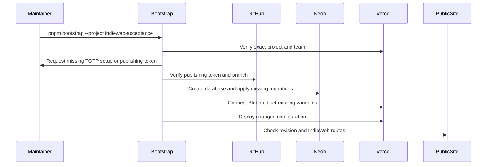

# Bootstrap and preflight

This reference is for Willie or an agent setting up a fresh checkout and its
IndieWeb deployment. Run `pnpm bootstrap --local-only` for local development.
Run `pnpm bootstrap --project indieweb-acceptance` to set up the isolated
deployment. Run `pnpm preflight --project indieweb-acceptance` afterward to
check it without changing provider resources. Start the app with `pnpm dev`.

The entry points match the LVBT website and TransitMapper projects. The
deployment target defaults to `indieweb-acceptance` when no Vercel project is
linked. Bootstrap links that exact project and team. It refuses an existing
link with an unexpected project ID or team ID. Use `--project website` only
when you intend to set up production.

The sequence diagram shows the deployment phase. The bootstrap process checks
owner credentials before creating resources, then checks the public alias
after any required deployment.

| Phase        | Bootstrap                                                  | Preflight                                                              |
| ------------ | ---------------------------------------------------------- | ---------------------------------------------------------------------- |
| `tools`      | Checks Node 24 and the pinned pnpm version.                | Same check.                                                            |
| `workspace`  | Installs the locked dependency tree and runs `pnpm check`. | Runs `pnpm check` against the installed tree.                          |
| `env`        | Copies `.env.example` to `.env.local` when absent.         | Reports whether `.env.local` exists.                                   |
| `auth`       | Checks GitHub, Vercel, Neon, `psql`, and `curl`.           | Same checks.                                                           |
| `deployment` | Sets up and verifies the selected project.                 | Checks the project, resources, configuration names, and public routes. |

Use `--phase env` to run one phase. `--local-only` runs the first three phases.
The command rejects `--local-only --phase auth` and `--local-only --phase
deployment`, since either combination would skip the phase you requested.
`pnpm check` runs with `INDIEWEB_POSTBUILD=0` so checks do not send Webmentions
or WebSub notifications. Preflight does not install packages or change provider
state. Its repository check can regenerate local build output.

The deployment phase creates the named Neon project when needed, checks its
IndieWeb schema, and applies `lib/db/migrations/000` through `003` when the
schema is incomplete. It creates or connects the named public Vercel Blob
store. It creates the acceptance publishing branch from `main` when needed.
It adds missing Vercel environment variables and pairs the acceptance
notification secret with the matching GitHub Actions secret. It redeploys
after configuration changes and checks that the public revision equals the
publishing branch head. It also checks homepage discovery, Micropub media
discovery, the writings feed, and IndieAuth metadata.

For a new IndieAuth enrollment, bootstrap prints a one-time TOTP key and URI
in the terminal. Scan it with your authenticator and press Enter. The command
also asks for a fine-grained GitHub token with Contents read/write on
`WillieCubed/website` when the selected project lacks one. Input is hidden,
and bootstrap checks that the token can write to the repository before it
creates remote resources. Neither credential is saved to a local file. The
current production enrollment already exists; its local copies were deleted
on September 23, 2026.

Vercel hides existing secret values. Preflight can verify their presence, but
it cannot prove that an existing publishing token still works. The isolated
Micropub write test in [IndieWeb testing](indieweb/testing.md) provides
that proof. Bootstrap leaves `INDIEWEB_NOTIFY_SECRET_PRODUCTION` unset until
Willie approves public posts. The [production rollout record](indieweb/production-rollout.md)
tracks that gate.
