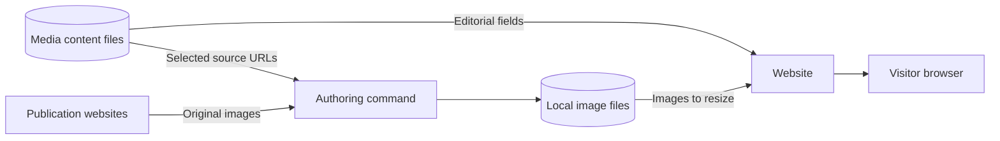

# Media mentions

This page is for the maintainer adding coverage to `/media`. Create a Markdown
file in `content/media/` and check the page at desktop and phone widths.
The filename supplies the entry's stable ID. Keep editorial content in these
files; `lib/media.ts` only loads and validates them.
Use lowercase letters, numbers, and hyphens in filenames.

For example, `content/media/las-vegas-sun-da-vinci.md` contains:

```yaml
---
title: Students Visit "Da Vinci-The Genius"
publication: Las Vegas Sun
url: https://lasvegassun.com/photos/2012/oct/01/451168/
published: '2012-10-01'
---
```

Store every field in frontmatter. Quote `published` as a `YYYY-MM-DD` string
so YAML cannot turn an invalid calendar date into a different day. The loader
rejects missing fields, invalid dates, unsafe source URLs, and unknown fields
with the filename in the error. The page and both search indexes read the same
content files. A production build includes new entries; rebuild and deploy
after changing content.

Use `draft: true` to preview a mention in development while keeping it out of
production and search. Files beginning with `_` are ignored.

Each entry records the publisher's headline, publication name, direct source
URL, and calendar date. For example, FOX5 Vegas published its Week Without
Driving story on September 30, 2026 despite October 1 appearing in its URL.
An appearance can be a quotation, an interview, or a photo caption. The page
does not assign role labels.

An optional `excerpt` contains an exact short quotation. An optional
`related` link points to the work discussed when there is a useful destination.
Both can be omitted. Excerpts start collapsed and work without JavaScript.

An optional `image` supplies a local copy of a photograph, video thumbnail,
or illustration from the article. Record the original asset URL in `source`,
describe what the image shows in `alt`, and preserve its attribution in `credit`.
Use the named photographer when the article gives one; otherwise credit the
provider without inventing a photographer. A selected image requires all four
fields, and `src` must name a JPG, PNG, WebP, or AVIF file under `/assets/media/`.
The image link exposes the credit in its title. Use `fit: contain` for graphics that should not be cropped.

Run `pnpm media:discover <id>` after adding an article's URL. The command lists
preview images, responsive and lazy-loaded photos, video posters, and images
from structured article metadata with available alt text and figure captions.
It also reads Arc Publishing article metadata, including FOX5 video posters.
Discovery works even when the entry already has a selected image.
Review the candidates: a preview can show a logo or an unrelated person, while a gallery may include a photograph
whose caption names Willie. The Clark Scholars entry uses the research poster
photograph rather than the gallery's first slide.

Add the selected image to the content file, then run `pnpm media:fetch <id>`:

```yaml
image:
  src: /assets/media/las-vegas-sun-da-vinci.jpg
  source: https://media.lasvegassun.com/media/img/photos/2012/10/01/1001DaVinci10_t650.JPG
  alt: Jeff Luo, Tenichi Mata, and Willie Chalmers III exploring the Da Vinci exhibit at the Venetian.
  credit: Steve Marcus / Las Vegas Sun
```

The command downloads to `public/assets/media/` and leaves the editorial fields
alone. `pnpm media:fetch --all` refreshes entries that already have a selected
source. The downloader decodes each image and checks its format before atomically
replacing the cached file. Failed requests, corrupt images, and failed writes
leave existing assets intact.
Downloads happen during authoring; builds and visitors do not depend on the
publisher being online. `pnpm content:check` checks every selected image for
existence and decodability, including drafts, without contacting publishers.
The build runs that check. Next.js resizes these local originals for each layout.

This container diagram shows where the images are fetched:



Images use compact thumbnails by default. An explicit `featured: true` gives
an entry the larger layout and moves it first within its year. FOX5 uses the
actual video still showing RTC Bike Share bicycles. All other entries remain
in date order. Entries without images reserve no thumbnail space.

As of October 5, 2026, RTC and Nevada Current return HTTP 403 to direct article
and WordPress API requests. Those two entries keep their source links and have
no image. Their text remains published; the fetch command does not fabricate
replacement art when a source cannot be fetched.

The shared top bar and footer use the `media` column to align with the page.
The top bar registers it only while visible, so cached pages cannot change
another route's footer. Before hydration, the shared footer stylesheet reads
the initial header only until the footer has its own `data-column`.

The archive includes coverage from 2012 through 2026. Add older or newly
discovered coverage when its source is verified. A publication's search can
find stories that general search engines miss; searching The UTD Mercury for
`Chalmers` returned several additional campus stories.

Jonsson School stories do not display publication dates in their article bodies.
Their [Fall 2021](https://engineering.utdallas.edu/news/archive/2021-fall/),
[Spring 2023](https://engineering.utdallas.edu/news/archive/2023-spring/), and
[Summer 2023](https://engineering.utdallas.edu/news/archive/2023-summer/)
archives supply those dates. The College Tour video uses YouTube's July 12,
2023 publication date. Its separate October 18 news entry is Kent Best's
Dallas Morning News story republished on The College Tour's website.

The `/media` entry in `lib/site.ts` supplies its metadata and adds it to the
footer, breadcrumbs, command palette, hover cards, search, and sitemap.
