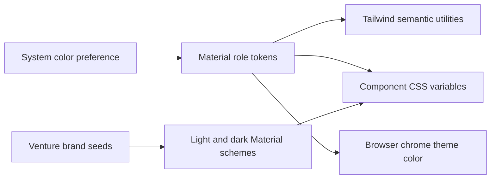

# Adaptive Theme Implementation Plan

> **For Codex:** Use the executing-plans skill to implement this plan task by
> task.

**Reader:** The maintainer who changes the site palette or adds a themed
component after September 19, 2026.

**Goal:** Make every site surface follow the visitor's light or dark system
preference and ease between the two without component-specific color forks.

**Architecture:** Material color roles in `app/globals.css` own both schemes.
Existing names such as `ground`, `tray`, and `ink` remain compatibility aliases
to those roles. CSS registers the changing roles as colors, so one root
transition interpolates every consumer. Runtime venture palettes generate light
and dark Material schemes through `light-dark()`. Reduced-motion users receive
an immediate theme change.

**Tech stack:** Tailwind CSS 4 theme tokens, Material Color Utilities, Next.js
16 viewport metadata, Node's test runner, and Chromium visual checks.

## Decision

The site will follow `prefers-color-scheme`. It will not store a second theme
state because the product has no theme control. One role layer will replace raw
Tailwind palette colors and explicit `dark:` branches in site components. This
keeps the contrast decision in one place and prevents a component from inventing
its own version of dark mode.

The rejected class-by-class approach would preserve the current split palette
and make future drift likely. A JavaScript theme provider would add hydration,
storage, and flash handling without giving the visitor a control that needs any
of them.

## Task 1: Lock the theme contract

**Files:**

- Create `tests/unit/theme-contract.test.mts`
- Modify `app/globals.css`

1. Add a test that scans rendered source classes and rejects Tailwind's raw
   color palette or `dark:` color branches outside the token file.
2. Add assertions for light and dark viewport colors and reduced-motion theme
   behavior.
3. Run the focused test and confirm that the current source fails the contract.

## Task 2: Build the adaptive token layer

**Files:**

- Modify `app/globals.css`
- Modify `app/layout.tsx`
- Modify `lib/site.ts`
- Modify `lib/brand/scheme.ts`
- Modify `lib/initiatives/theme.ts`
- Modify `lib/plain-page.ts`

1. Define light and dark Material role values, compatibility aliases, semantic
   status roles, and the theme motion duration.
2. Register the changing color roles and transition them only when motion is
   allowed.
3. Publish scheme-specific browser chrome colors.
4. Generate both Material schemes for venture and initiative colors.
5. Make the small standalone protocol pages use the same two schemes.

## Task 3: Remove component color forks

**Files:**

- Modify affected files under `app/`, `components/`, and `lib/writings/`
- Modify `components/home/home.css`
- Modify `components/initiatives/initiatives.css`

1. Replace raw palette utilities with semantic roles.
2. Remove redundant `dark:` color variants.
3. Replace remaining CSS color literals with role tokens or `color-mix()` based
   on role tokens.
4. Wire Shiki and prose colors to the active semantic roles.

## Task 4: Verify behavior and presentation

1. Run the focused theme contract test, the full unit suite, type checking,
   linting, and a production build with at most two workers.
2. Render the homepage, an initiative, and a writing at 390px and 1440px in
   both color schemes.
3. Change the emulated system scheme in place and confirm that computed colors
   interpolate when motion is allowed and switch immediately for reduced
   motion.
4. Inspect screenshots for contrast, stray light surfaces, layout changes, and
   overflow.

## Open limit

Third-party embeds own their internal appearance. The site can theme the frame
and fallback text, but it cannot animate pixels rendered inside a Spotify,
SoundCloud, or YouTube iframe.
