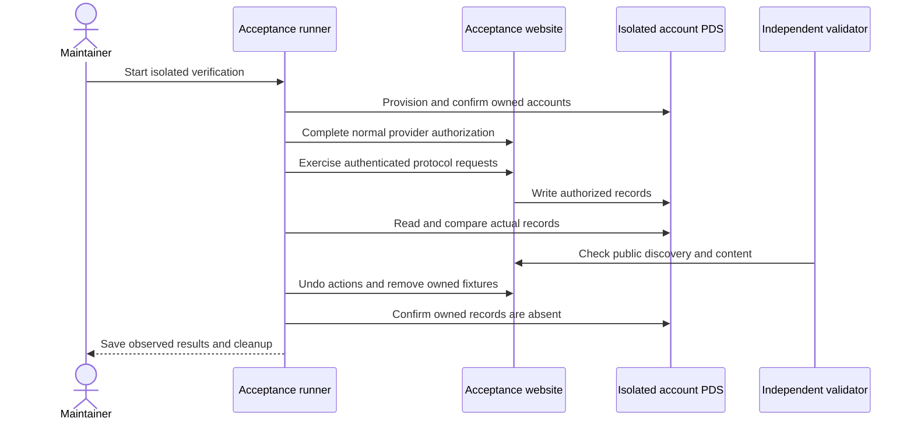

# Publishing verification

This guide is for Willie and the maintainer running the release checks. Run the isolated checks, retain their receipts, and close the linked issues only when their external behavior and cleanup pass.

Use `codex/publishing-compatibility-acceptance-20261008` in the separate acceptance checkout. Its public origin is `https://indieweb-acceptance.vercel.app`. Its Vercel project is `prj_rurUFlQ4YKYKoMxGCaAyL6ASijHm`. Never use the production owner account or production database for these checks.

The [conformance matrix](publishing-conformance.md) records the baseline and remaining results. The [revised identity plan](superpowers/plans/2026-10-08-acceptance-identities.md) makes the tooling own two test accounts instead of requiring Willie to create them. It uses temporary official PDS infrastructure and requires real public relay and AppView evidence. The five epics are [Standard.site](https://github.com/WillieCubed/website/issues/155), [visitor social actions](https://github.com/WillieCubed/website/issues/159), [Bluesky](https://github.com/WillieCubed/website/issues/163), [IndieWeb](https://github.com/WillieCubed/website/issues/167), and [WebSub](https://github.com/WillieCubed/website/issues/173).

## Run the checks

`scripts/publishing-acceptance-setup.mts` provisions two tool-owned identities through the official PDS. It generates credentials, completes the normal account confirmation flow, verifies real public AppView reads, and configures only acceptance. Its private ownership journal supports recovery after interruption. Willie does not need to create accounts or paste passwords. The numbered social capture companion works from a clean acceptance checkout. After credential setup, it creates a missing named `*-acceptance-*` fixture and records its exact bytes privately. It preserves ownership of any preexisting fixture.

The companion temporarily marks only that fixture draft and refuses any other public source. It runs Standard.site lifecycle/extensions and Bluesky posting/response checks, restores the fixture, then deploys and verifies its public records. It then publishes real Atmosphere replies, media, quotes and reactions on that hosted fixture. It checks its cache after edits, hiding, restoration and deletion. It captures full-page 1440px and 390px images in both themes. It pauses for the independent validator result while the fixture remains public. It inspects the real acceptance branch notification workflow before normal sign-in and consent in separate browser contexts. Only journaled identities on the exact owned provider can use automated credentials. Other providers retain manual authorization. The agent must not create a provider grant from a seeded database row.

| Runner                                               | What its successful receipt proves                                                                                                                                                                                                                                                                                                                          |
| ---------------------------------------------------- | ----------------------------------------------------------------------------------------------------------------------------------------------------------------------------------------------------------------------------------------------------------------------------------------------------------------------------------------------------------- |
| `scripts/standard-site-acceptance.mts --write`       | Real PDS create, update, unchanged sync, extension preservation/removal, draft exclusion, foreign-record preservation and cleanup. Run before adding a public fixture.                                                                                                                                                                                      |
| `scripts/standard-site-acceptance.mts --verify SLUG` | Real PDS records agree with the hosted publication endpoint and document head links. This does not establish an independent validator pass.                                                                                                                                                                                                                 |
| `scripts/bluesky-acceptance.mts --write`             | Real opt-in copies, strong references, retry recovery, duplicate prevention and native response changes through AppView. The response importer receives a constructed writing; this does not prove hosted response rendering.                                                                                                                               |
| `scripts/atproto-hosted-responses.mts`               | Real automatic copy persisted in the actual fixture source, successful AppView replies/media, hosted text/nesting/image/playable video/file/quote/reactions, cache edit/hide/restore/deletion refresh, full-page 1440px/390px screenshots in both themes, and exact record/source restoration.                                                              |
| `scripts/atproto-social-capture.mts`                 | Standard.site and Bluesky checks, normal provider authorization in isolated contexts, signed callback provenance, social checks, and exact ownership cleanup. It removes an unchanged source it created and redeploys clean acceptance.                                                                                                                     |
| `scripts/atproto-social-acceptance.mts --write`      | Real social endpoint writes, matching PDS records, undo, browser isolation, replay rejection and sign-out. The companion forces a supported provider refresh in two processes and verifies authenticated PDS reads and changed token generations under the shared locks.                                                                                    |
| `scripts/indieweb-acceptance.mts`                    | Live Authorship/Webmention discovery fixtures and independent parsing of current component/feed output. These inputs do not establish a hosted publishing lifecycle.                                                                                                                                                                                        |
| `scripts/indieweb-acceptance.mts --live-media`       | Real S256 consent, four retained media uploads, one isolated writing, parsed feed/Microformats checks, native controls, deduplication and SHA-256 comparison of public media with original upload bytes. The October 9 hosted run passed all nine checks and exact cleanup; its receipt records the cleanup promotion separately from automatic deployment. |
| `scripts/websub-acceptance.mts --expect MARKER`      | A real topic-bound challenge, signed changed-feed receipt and verified unsubscribe. The marker must be absent before subscription.                                                                                                                                                                                                                          |

The combined numbered account flow is:

```sh
pnpm exec tsx scripts/atproto-social-capture.mts --workspace /Users/williecubed/.codex/worktrees/publishing-verification/website --slug websub-acceptance-20261008
```

The fixture exists only on the isolated acceptance branch. The command creates it when absent. The two owned identities are already provisioned, configured and federated. During social verification, the hosted page and its PDS records remain available. Cleanup first finishes response and browser cleanup. It removes only an unchanged source it created, redeploys the explicit acceptance project, and requires that source URL to return `404`. It then dispatches the final branch notification, confirms that all acceptance notification jobs ended, and drains HTTP handlers for 70 seconds against their 60-second limit. It observes the authorized final record CIDs and removes the owned document and publication last. It restores a preexisting publication and checks foreign records remain unchanged. Unknown workflow state blocks cleanup. It leaves a preexisting fixture source for its owner to remove.

Resume a failed cleanup with `--cleanup-only` and the same private `--output` directory. The helper dispatches pending Standard.site, Bluesky and hosted-response cleanup receipts before source removal. It preserves the fixture document while hosted-response recovery remains pending. The hosted helper restores the exact original document CID and owned source bytes before the outer fixture cleanup can remove them. It retains encrypted grant recovery data while record or provider cleanup remains pending. It retains the source manifest until the clean deployment passes. A cleanup retry can verify completed browser cleanup without resurrecting a revoked grant. It resumes the exact notification run and source deployment before final PDS cleanup. It checks later branch-job activity before and after the drain instead of trusting an old receipt. It rejects any changed PDS CID outside a persisted owned version during recovery.

Run the live media check with `pnpm exec tsx scripts/indieweb-acceptance.mts --live-media --output .playwright-mcp/indieweb-media-live-20261009/receipt.json` after other acceptance writers finish. If cleanup fails, add `--cleanup-only` to the same command and keep the same output path. The runner preserves evidence, checks source ownership against the exact creation commit and refuses changed source, archive or blob deletion. It removes the private recovery journal last.

Run each script with `pnpm exec tsx`. The PDS runners accept `--env` and `--receipt`. Private receipts record owned keys so cleanup never requires deleting a whole collection. Never commit cookie exports, callback codes, app passwords, signing keys or storage keys.

The hosted WebSub mode requires a temporary callback deployed only on acceptance. Its route must check the exact project, origin and database. Remove the route, rows and table after unsubscribe. A hub's acceptance response cannot pass the receipt check. A manual publisher trigger cannot pass an automatic workflow check.

## External checks remain distinct

Use the independent Standard.site validator and Rocks clients where browser access and client authentication permit them. Retain each run URL and result. A blocked browser policy is an unresolved result. Do not access a denied validator through another tool to bypass the restriction.

The earlier Bluesky runner proves importer behavior with an in-memory writing. The hosted-response helper closes that executable-path gap by using the real source loader and deployed writing page. A generated MP4 or simulated response does not pass it. The helper follows [Bluesky's documented video upload method](https://bsky.network/docs/about-bluesky-content/video/) and waits for an AppView playlist and browser playback with a positive duration. A pending transcode or failed media request leaves the result incomplete.

Before any media writes, the numbered companion reads the isolated account email status from its PDS. A tool-owned account must complete the normal confirmation flow when its provider requires it. The independent validator must inspect the hosted writing URL while its real PDS document exists. A supplied run URL or exported report remains `operator-reported-unverified` or `pending` until the independent result is reviewed. The helper does not establish a validator pass by trusting that input. It does not access a denied domain through another tool. Its workflow receipt requires the actual acceptance branch run to report `synced`; that result proves neither automatic push triggering nor subscriber receipt.

The [Standard.site lifecycle receipt](evidence/standard-site-live-20261008.json) records 14 successful checks. The [independent validator receipt](evidence/standard-site-independent-20261008.json) records 16 browser-observed checks against the hosted document and its real PDS record. The [final social receipt](evidence/atproto-social-live-20261009.json) adds 18 API checks, five UI failure checks and logout through normal provider consent. Its exact graph and database cleanup passed; independent provider inspection found zero canonical-client tokens for both owned DIDs. Its empty foreign-token baseline does not establish preservation of populated unrelated grants.

The [hosted Atmosphere receipt](evidence/atmosphere-hosted-live-20261009.json) records eight checks, 20 hosted captures and four same-page captures with IndieWeb responses. The corrected supplemental browser probe establishes positive incoming audio/video playback. The [media/feed receipt](evidence/indieweb-media-live-20261009.json) establishes parsed live JSON Feed, media deduplication, exact public-byte hashes and cleanup. IndieWeb and WebSub evidence also retains actual authorization, publishing, response verification and signed subscriber delivery.

The recorded functional acceptance checks pass, but the final audit found one missing live criterion in #166: overlap deduplication between IndieWeb and Atmosphere. The existing unit check and distinct combined responses do not prove that one real overlapping response displays once. Run that isolated hosted check after the deployment quota resets, retain its render and remove its owned records. Epic #163 and subtask #166 remain open until that proof exists.

Use the same owned actor for a native Bluesky repost and an incoming IndieWeb repost of the isolated writing. The public `h-entry` must contain `u-repost-of` for the writing and an author `h-card` whose `u-url` matches the actor’s canonical Bluesky DID profile. Deliver and approve it through the actual receiver and moderator. Confirm both input paths independently contain the actor, then assert that the hosted writing renders exactly one matching `.u-repost`. Retain the source link, screenshot and exact cleanup of the repost, mention, source Worker and fixture. This scenario exercises the implemented actor-and-type identity rule without fabricating storage rows.

The final social run retained 180 captures after invoking its color/transition predicates and checking overflow. An independent agent also inspected 20 representative current captures and found no actionable defect. It did not inspect all 180 images. Production deployment and public endpoint checks remain release gates. The [final infrastructure cleanup](evidence/acceptance-infrastructure-cleanup-20261009.json) removed the owned configuration, publication, accounts and infrastructure.

The following sequence diagram separates publication from independent verification:



The runner sends real requests to the acceptance site and reads the isolated PDS. The independent validator checks the public site separately. Both results are required where the corresponding issue requires them. Remove temporary content and verify production remains free of fixtures before closing the release work.

Narrow modes such as `--authorization-only`, `--social-only`, `--retained-runtime` and `--defer-bluesky` support diagnosis and recovery. Their receipts cover only the recorded runtime and scope. A partial run does not replace the completed lifecycle, hosted-response, social and cleanup receipts. Keep source overlays and local verifier hashes distinct from the deployed Git revision.

A timed-out mutation may complete after its HTTP response is lost. Cleanup must compare current records with the exact owned CID inventory and retain its journal until stable graph, grant, source and publication cleanup passes. Do not accept an old cleanup receipt as ownership of a new fixture.

## Release to production

Acceptance and production have migrations 005–009. The [production migration receipt](evidence/production-publishing-migration-20261009.json) records atomic application of 006–009 and successful schema checks. The comparison preserved all seven fields of the one legacy access-token row, including its exact expiry. New grants use the new expiry rules.

The [production migration helper](../scripts/production-publishing-migrate.mts) defaults to a read-only check. Its approved application used `--apply --acceptance-approved` and a fresh private output directory. Do not reapply completed migrations. It verifies the exact Neon project and host, locks the existing authorization tables, applies only 006–009 in one transaction and compares all seven original token fields before commit. Retain its private baseline and receipt. Follow any ambiguous commit with a fresh read-only check instead of assuming rollback.

Run lint, TypeScript, the full unit suite and a bounded production build on the release revision. The amended implementation passed all 846 existing unit tests, full ESLint, TypeScript and a production build with two build workers on October 9. The response and content changes also passed all 21 applicable existing behavior tests. Acceptance verification remains separate from these local checks.

Deploy the checked production revision after final capture review passes. Verify the production publication HTTP/PDS agreement, public OAuth/discovery endpoints, feed responses and absence of acceptance content. Existing authored drafts remain private. Production document/recommendation verification requires Willie to approve a real writing for publication; isolated acceptance proves the behavior without publishing a draft.

The [final notification and cleanup receipt](evidence/acceptance-notification-final-20261009.json) records source removal and fixture `404` on clean acceptance revision `4d0ff1f9a76010ff429c84b9917fa6da4416297c`. Its [push workflow](https://github.com/WillieCubed/website/actions/runs/37919522943) and [dispatched workflow](https://github.com/WillieCubed/website/actions/runs/37919577933) both reported `synced`. The parent drained in-flight handlers before exact document/publication cleanup passed. A signed WebSub subscriber receipt establishes a separate delivery result.

Earlier missing-identity and deployment-quota failures remain historical evidence. Two subsequent `4d` builds succeeded. Final infrastructure teardown passed after the functional checks and receipt preservation. The production migration has its own receipt. The [fresh rollout receipt](evidence/production-rollout-blocked-20261009.json) records both rejected production paths after100 deployments. The provider reports a24-hour retry. Existing ready production artifacts contain older source, and preview artifacts lack the production-only publishing credential. Production remains on `59f0c063` with zero feed items and no acceptance writing. Retry one exact-main deployment after quota becomes available, then run the required notification and public checks. Both original build settings were restored.
