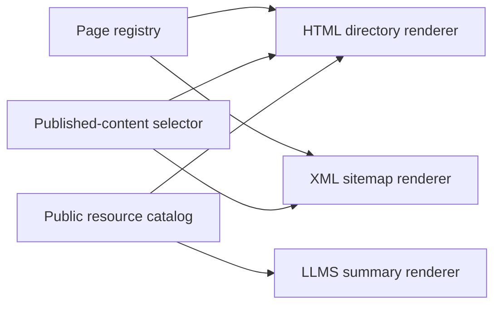

# Sitemap

This page is for the maintainer adding public pages or resources to the site.
Add a routed page to the registry in `lib/site.ts`; add a programmatic resource
to `lib/indieweb/resources.ts`. Do not maintain a separate sitemap URL list.

The HTML directory at `/sitemap` puts top-level destinations under Browse.
It groups published initiatives and their parts, writings in publication
order, and topics in separate sections. Search appears as a human utility. The directory omits its own link, empty content groups, and drafts,
even in development. The XML sitemap also excludes Search and retains only
canonical URLs and actual content modification dates.

Both renderers use `publishedSitemapContent` for content selection. A new
published writing or initiative appears through the normal content loaders.
The reader-facing feeds and downloads come from the same catalog as
`llms.txt`. A resource's `directory` field groups its format variants under
one description. The HTML page does not list the internal hover-card index,
crawler rules, or protocol discovery files. The Tools section lists features
a visitor can use: browser search, MCP, Webmentions, and embeds. Each has a
short description. A tool requiring a client or request parameters shows its
address, a usage note, and a documentation link instead of a broken browser
link. Publishing and sign-in infrastructure stays out of the directory. AT Protocol discovery
remains conditional in `llms.txt`.

Each page and content link has a short description. Each feed collection
shows one description and its available formats. Tools describe their purpose
instead of listing supported standards. Sections have responsive grids: one column
below 600px, two from 600px, and up to three from 840px. Resource sections
with two or four entries use two columns at desktop widths. Feed and
file links use full browser navigation because the app router cannot render
their responses.

We chose separate HTML and machine URLs so clients can request a known format.
User-Agent detection and content negotiation would complicate caching and
change existing endpoints without improving the directory.

This component diagram shows the shared sources and their consumers:

Use the repository checks after changing the registry or catalog. Check the
rendered directory at desktop and phone widths, and confirm that each link has
a description. Discovery files belong in protocol responses and maintainer
docs, not in this directory.
