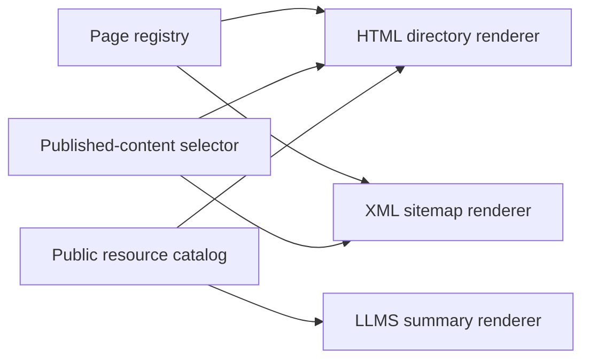

# Sitemap

This page is for the maintainer adding public pages or resources to the site.
Add a routed page to the registry in `lib/site.ts`; add a programmatic resource
to `lib/indieweb/resources.ts`. Do not maintain a separate sitemap URL list.

The HTML directory at `/sitemap` groups pages, published initiatives and their
parts, writings in publication order, and topics. Search appears as a human
utility. The directory omits its own link, empty content groups, and drafts,
even in development. The XML sitemap also excludes Search and retains only
canonical URLs and actual content modification dates.

Both renderers use `publishedSitemapContent` for content selection. A new
published writing or initiative appears through the normal content loaders.
The reader-facing feeds and downloads come from the same catalog as
`llms.txt`. A resource's `directory` field groups its format variants under
one description. The HTML page does not list the internal hover-card index,
crawler rules, or protocol discovery endpoints. It states supported standards
instead. Configured AT Protocol identity adds its support to that statement.

Each page and content link has a short description. Each feed collection
shows one description and its available formats. Sections have responsive
grids: one column below 600px, two from 600px, and three from 840px. Feed and
file links use full browser navigation because the app router cannot render
their responses.

We chose separate HTML and machine URLs so clients can request a known format.
User-Agent detection and content negotiation would complicate caching and
change existing endpoints without improving the directory.

This component diagram shows the shared sources and their consumers:

Use the repository checks after changing the registry or catalog. Check the
rendered directory at desktop and phone widths, and confirm that each link has
a description. Protocol endpoint addresses belong in discovery responses and
maintainer docs, not in this directory.
