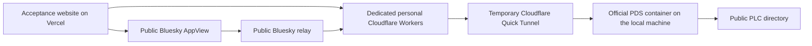

# Acceptance identity provisioning

This plan is for the implementing agent. Provision the acceptance identities, run the existing live checks, and retain evidence before closing the remaining verification subtasks.

The revised workflow owns two test identities. Willie does not need to create Bluesky accounts or copy app passwords. The production account, production database, authored drafts, and unrelated infrastructure remain outside the acceptance writes.

## Decision

Use the official PDS in a temporary local Docker container with an owned Docker volume. Expose it through a temporary Quick Tunnel and dedicated Workers on the personal Cloudflare account `18f90fa11cf0a87145be4a1517e41217`. The verified workers.dev subdomain is `willieechalmers-18f`. Use a separate Worker for each handle. Provision two accounts through the normal invite and account endpoints. Generate their credentials and store them privately.

The PDS must use the public PLC directory, relay, and Bluesky AppView. A successful local request or accepted crawl request does not establish federation. Require the public AppView to resolve both identities and read their real records before continuing the Bluesky checks.

We rejected use of the production account because test posts would appear under Willie's identity. We rejected a simulated PDS or private AppView because those cannot prove the requested network behavior. The existing named tunnel belongs to Hypertext Studio and must not be reused. A permanent hosted PDS remains outside the website's feature scope.

The official Docker `0.4` tag currently resolves to index digest `sha256:3a8feb3415e319dbcc13372293b7ef1fb05a318a6ff1d55968cf99ba6633c5d4`. Pin the digest and record the running server version. Do not infer the Docker tag from the npm package version.

## Execution

- [x] Verify Docker, personal Workers credentials, and the public workers.dev subdomain.
- [x] Add a resumable provisioning runner that journals only resources it creates. Generate unique names, reject collisions, keep invitations required, and bind container ports to loopback. Bound the PDS to 1 CPU and 1 GiB of RAM.
- [x] Deploy the canonical PDS proxy and two handle endpoints. Stream HTTP bodies and WebSocket upgrades. Preserve the PDS's public issuer and redirects. Reject unknown hosts and never proxy another provider's authentication pages.
- [x] Create two accounts through the official invite/account APIs. Validate DID documents, handle discovery, app-password sessions, and OAuth metadata. Use normal email confirmation through a controlled SMTP receiver if the PDS requires it. Do not seed grants or mark email verified in a database.
- [x] Verify actual relay ingestion and public AppView reads. Store sanitized results with timestamps and identifiers. Keep a failed federation check unresolved.
- [ ] Configure only the existing acceptance Vercel project. Reuse the existing publication and social runners. Automate the normal provider UI only for the two identities owned by this provisioner. Retain genuine callback, refresh, write, undo, and browser-isolation checks.
- [x] Run the independent Standard.site validator through the permitted browser. All 16 checks and exact fixture cleanup passed.
- [ ] Complete real syndication, response refresh, media playback, screenshots and visitor social checks with their exact fixture cleanup.
- [ ] After record and grant cleanup, deactivate the owned accounts and remove only owned Workers, containers, tunnels, and private credentials. Preserve recovery state if cleanup fails. A public PLC identity entry can remain after deactivation; never claim its permanent directory history was erased.
- [ ] Update the conformance matrix and issues with observed results, run the applicable bounded checks, and finish the approved release only when its gates pass.

## Deployment diagram

The acceptance website writes to the temporary PDS. Dedicated Workers route public requests through its tunnel. The public relay ingests the signed repositories and the public AppView supplies independently observed Bluesky responses.

## Remaining uncertainty

Public relay ingestion, AppView indexing, video availability, and the provider's current permission-set behavior require execution. The owned identities passed public AppView profile and post-CID checks on October 8, 2026. The acceptance credentials are configured. Independent document validation passed all 16 checks with exact cleanup. Real website OAuth, complete syndication/response refresh, hosted video delivery and visitor social checks still require their own completed results.

The provisioning methods follow the [official PDS tooling](https://github.com/bluesky-social/pds) and [account management guidance](https://atproto.com/guides/going-to-production). The proxy uses [Workers WebSocket support](https://developers.cloudflare.com/workers/examples/websockets/) and [workers.dev routing](https://developers.cloudflare.com/workers/configuration/routing/workers-dev/).

The owned container twice exited with code 135 while SQLite integrity checks passed. The crash cause remains unproven. The storage migration byte-matched 108 files, checked five SQLite databases and preserved both accounts' existing record URIs and CIDs. The original bind data and stopped container remain available for guarded rollback. Runtime and cleanup checks require the exact image, environment, command, limits, mounts and ownership labels.
